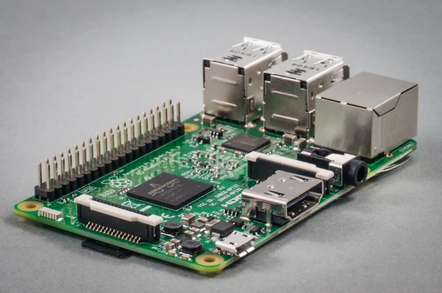
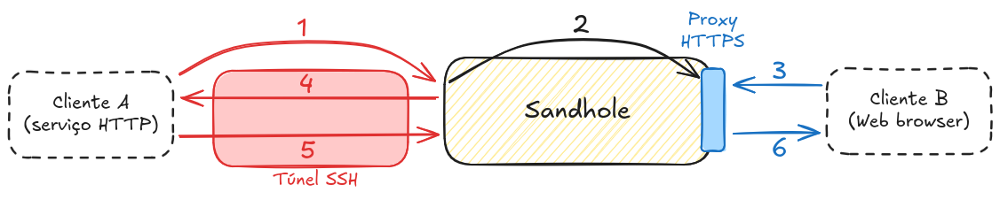

println!("Hello, world!");
===

<!-- column_layout: [2, 1] -->

<!-- column: 0 -->

- Eric **"Epic Eric"** Pires 
- Engenheiro de software @ **Artemis Technologies**
- Anteriormente @ **NIC.br**
- Entusiasta de open-source e Rust

<!-- column: 1 -->


<!-- end_slide -->

Self-hosting
===




<!-- end_slide -->

Self-hosting
===

<!-- incremental_lists: true -->

- Independência virtual.
- Privacidade e controle.
- Reciclagem de hardware.
- Aprendizado sobre tecnologias.
- É divertido!
- <3 open-source.

<!-- end_slide -->

Desafios
===

<!-- pause -->

IPs dinâmicos...

<!-- pause -->

E port forwarding...

<!-- pause -->

E Network Address Translation (NAT)...

<!-- incremental_lists: true -->

- VPN
  - Software específico nos dois lados
- VPS com IP público
  - Limitado aos recursos da máquina
- Proxy reverso
  - Ainda precisa de uma maneira de conectar

<!-- end_slide -->

E se eu somar tudo? Existe uma solução...?

<!-- pause -->

Sim. Sim, há.

<!-- pause -->

<!-- jump_to_middle -->

SSH
===

<!-- end_slide -->


Um reverse proxy baseado em SSH.
- Sem mais problemas de NAT!
- Domínios personalizados
- Autenticação via chaves SSH

```bash
ssh -R meusite.com.br:80:localhost:3000 sandhole.com.br
```

<!-- end_slide -->

E mais...!
===

- HTTPS automático para serviços expostos
- Load balancing
- Suporte a portas TCP, incluindo SSH
- Forwarding local - quase como uma VPN
- Diversas configurações via linha de comando
- UI de administração no terminal (via SSH, claro)

```fish +exec +acquire_terminal
ssh -t sandhole.com.br admin
```

<!-- end_slide -->

<!-- jump_to_middle -->



<!-- alignment: center -->

https://sandhole.com.br

<!-- end_slide -->

Por que esse projeto?
===

<!-- pause -->
Baseado numa aplicação existente (sish, em Golang).
<!-- pause -->
Pouca experiência prévia em Rust e proxies.
<!-- pause -->
Por que _não_ reescrever em Rust...?


<!-- end_slide -->

A linguagem certa?
===

<!-- incremental_lists: true -->

<!-- column_layout: [1, 1] -->

<!-- column: 0 -->

- Baixo nível (HTTP, TCP, TLS, SSH...)
- Ecossistema de bibliotecas
- async via tokio
- Performance por padrão

<!-- column: 1 -->

- Tipagem e erros de compilação
- Testes unitários+integração
- CI/CD, cross-compilation com Docker
- Refatoração sem medo

<!-- reset_layout -->

<!-- pause -->

<!-- new_lines: 2 -->

<!-- alignment: center -->

Aprendizagem => Síntese

<!-- end_slide -->

<!-- jump_to_middle -->

Demonstração
===

```fish +exec +acquire_terminal
~/tmp/demo/CraneGame_linux_x86_64
```

<!-- end_slide -->

Obrigado!
===

<!-- column_layout: [2, 1] -->

<!-- column: 0 -->

https://github.com/EpicEric/sandhole

- E-mail: eric@eric.dev.br
- Discord: @epiceric
- Telegram: @ericpires9

<!-- column: 1 -->


